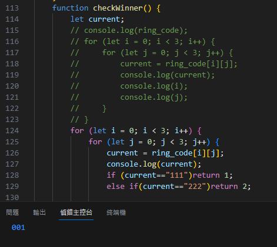
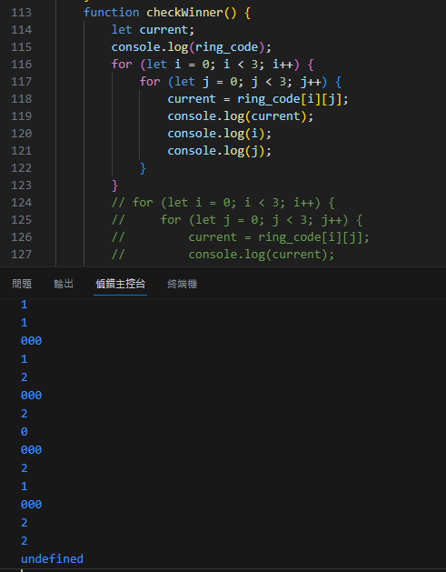

# 9_rings_JS
A simple prototype for 9 ring game.

## rules & implement
There is a 2-dimensional x by y text array called `ring_code`, with a size of 3x3. Each element in the text array is a string consisting of three digits, for example: "000". The possible values for the digits are 0, 1, and 2.

If all three digits within an element are 1, then player 1 wins. If all three digits are 2, then player 2 wins. For example, "111" or "222".

Another winning condition is when any of the elements in a row, column, or diagonal have the same digit. If the digit is 1, then player 1 wins. If the digit is 2, then player 2 wins. For example, "100", "100", "100".

There is also another winning condition where the elements in the first, second, and third positions, connected horizontally or diagonally, have the same digit. This also results in a win. For example, "100", "010", "001".

## problems

> the first problem I met is that it only run once. So it cannot detect successfully.

> the second problem I met is that it should only run 9 times but it run 10.

# WTF JS？
